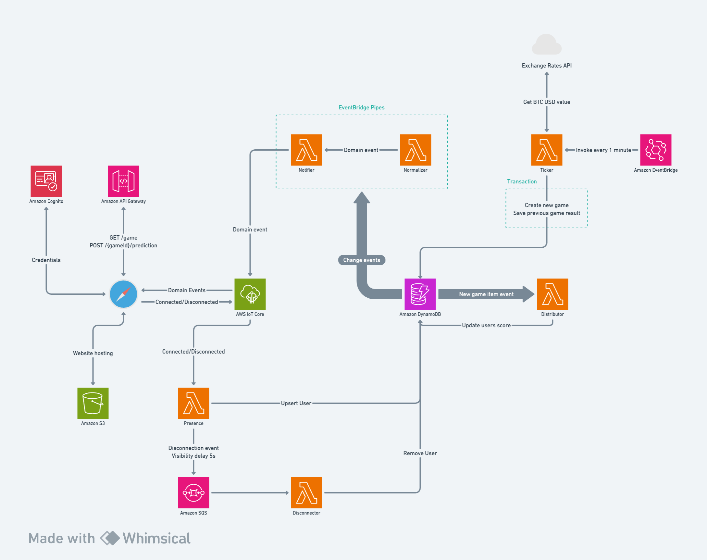
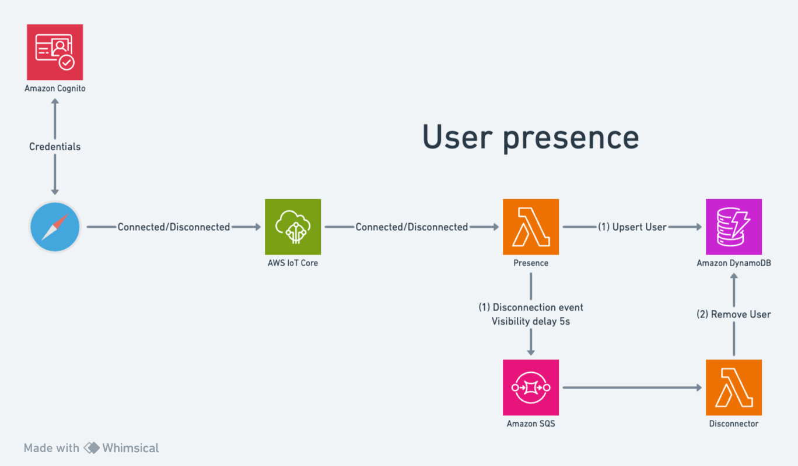

# BTC Guesser

Guess the next price of BTC in USD... with a twist – the multiplayer component!

_The price of the BTC in USD refreshes every 60 seconds or so_.

## Requirements

1. [pnpm](https://pnpm.io/) version `8.7.6` or higher

2. [node](https://nodejs.org/en) version `18.18.0` or higher

3. (Optional) [volta](https://docs.volta.sh/guide/) version `1.1.1` or higher

_Volta is a great tool to manage different versions of package managers and Node. I use it as an alternative for [nvm](https://github.com/nvm-sh/nvm) which I found unreliable in the past. **To use Volta with `pnpm`, please [see these docs](https://docs.volta.sh/advanced/pnpm)**_.

4. An AWS account and the ability to get the role/user credentials.

## Deployment

1. Ensure that your shell has the necessary AWS-related environment variables set. These are `AWS_ACCESS_KEY_ID`, `AWS_SECRET_ACCESS_KEY_ID`, `AWS_SESSION_TOKEN` and `AWS_REGION`. To check which variables are set, please type the following:

```shell
printenv | grep "AWS_"
```

_For local development & deployment, I was using a role with [AdministratorAccess](https://docs.aws.amazon.com/aws-managed-policy/latest/reference/AdministratorAccess.html) policy_.

2. Bootstrap the backend

```shell
pnpm run bootstrap
```

3. Deploy the backend

```shell
pnpm run deploy
```

**Note**: If the role/user used to deploy the backend cannot create publicly-accessible buckets, the deployment might fail. To deploy the backend without a "website hosting" bucket, type the following:

```shell
pnpm run deploy:without-hosting
```

4. (Optional) Upload the frontend artifacts to the "website hosting" bucket. The game is a multiplayer game, so it might be worth trying it out with others!

```shell
pnpm run deploy:website
```

The output of this command will contain the link to the website.

**Note**: This step will fail if you deployed the backend without hosting.

## Running the application locally

1. Deploy the backend, either with or without the hosting.

2. Run the application locally

```shell
pnpm run dev
```

3. Access the application at [http://localhost:5173/](http://localhost:5173/)

## Architecture



The backend architecture could be split in several components.

### The user presence

This component is responsible for marking the user as "CONNECTED" or "DISCONNECTED". "DISCONNECTED" users are not shown in the player list.

The client subscribes to the [IoT Core MQTT topic](https://docs.aws.amazon.com/iot/latest/developerguide/topics.html) called `game`. From there, AWS Lambda Functions listen to the [IoT Core lifecycle](https://docs.aws.amazon.com/iot/latest/developerguide/life-cycle-events.html) events and update the user state accordingly.

IoT Core requires signed requests. Cognito was added to handle all things related to user credentials and authorization.



### The game ticker

To update the value of the BTC in USD every 60 seconds or so, I'm utilizing an [EventBridge rule](https://docs.aws.amazon.com/eventbridge/latest/userguide/eb-rules.html) that runs on a schedule. This rule invokes an AWS Lambda which fetches the latest BTC price and populates the application state.


### The score distributor

When the "game ticker" runs, it creates a "game result" item in DynamoDB. The role of the _score distributor_ component is to listen to "game result" item creations and update the user scores accordingly. The scores for each user are persisted in the DynamoDB.


### The notifier

The role of the _notifier_ component is to stream domain events (`UserPresenceEvent`, `GameEvent` and `PredictionEvent`) to the frontend application. The frontend application has a live connection with the IoT Core MQTT topic.

This component utilizes [EventBridge Pipes](https://docs.aws.amazon.com/eventbridge/latest/userguide/eb-pipes.html). The _Normalizer_ (transformation/enrichment step) transforms the stream data from DynamoDB into domain events. The _Notifier_ pushes the domain events into the MQTT topic.


## Possible improvements

1. Surface the concept of "game rooms" to the client. The concept of a "game room" is only used on the backend for the purpose of making the testing easier. It enables the creation of isolated data entities which do not influence the running application.

2. Introduce a new index to expose leaderboards. The DynamoDB already contains all the users and their scores.
